# COMPREHENSIVE vLEI AGENT DELEGATION VERIFICATION - DEEP DESIGN

## Executive Summary

This document presents a **production-grade** delegation verification system that goes deep into KERI/vLEI internals, based on official documentation from:
- `101_47_Delegated_AIDs.md` - Cooperative delegation process
- `103_10_vLEI_Trust_Chain.md` - vLEI trust chain and credential edges
- `101_75_ACDC_Edges_and_Rules.md` - Edge operators (I2I, NI2I, DI2I)
- `101_40_Witnesses.md` - Witness consensus and TOAD

## Current Implementation Gap Analysis

### What Current Script Does ✓
1. Connects with two passcodes (agent and OOR holder)
2. Checks agent KEL exists
3. Verifies agent has delegation field (di)
4. Checks delegator matches OOR holder
5. Verifies OOR holder KEL exists

### What Is Missing ✗
1. **KEL Structure Validation** - No verification of delegation seal in OOR KEL
2. **Witness Receipt Verification** - No checks on witness consensus
3. **Seal Digest Matching** - No cryptographic verification of delegation approval
4. **Credential Chain Verification** - No vLEI trust chain validation
5. **Edge Operator Validation** - No I2I/DI2I compliance checking
6. **State Consistency** - No cross-validation of KEL vs KERIA state
7. **OOBI Resolution Chain** - No verification of bidirectional OOBI access

---

## Comprehensive Verification Architecture

```mermaid
graph TB
    START[Start Verification]
    
    subgraph "Level 1: Basic Delegation"
        L1A[Agent KEL Exists]
        L1B[Agent Has di Field]
        L1C[Delegator Matches OOR]
        L1D[OOR KEL Exists]
    end
    
    subgraph "Level 2: KEL Structure"
        L2A[Parse Agent DIP Event]
        L2B[Parse OOR IXN Event]
        L2C[Verify Seal Structure]
        L2D[Match Seal Digest]
        L2E[Verify Sequence Numbers]
    end
    
    subgraph "Level 3: Witness Consensus"
        L3A[Agent Witness Receipts]
        L3B[OOR Witness Receipts]
        L3C[TOAD Threshold Check]
        L3D[Witness Signature Validation]
    end
    
    subgraph "Level 4: OOBI Resolution"
        L4A[Agent OOBI Accessible]
        L4B[OOR OOBI Accessible]
        L4C[Bidirectional Resolution]
        L4D[KERIA Contact Database]
    end
    
    subgraph "Level 5: Trust Chain"
        L5A[OOR Credential Exists]
        L5B[Trace to OOR AUTH]
        L5C[Trace to LE]
        L5D[Trace to QVI]
        L5E[Validate Edge Operators]
        L5F[Verify Schema SAIDs]
    end
    
    subgraph "Level 6: State Consistency"
        L6A[KEL vs KERIA State]
        L6B[Registry State Check]
        L6C[Revocation Status]
        L6D[Timestamp Validation]
    end
    
    START --> L1A
    L1A --> L1B --> L1C --> L1D
    L1D --> L2A
    L2A --> L2B --> L2C --> L2D --> L2E
    L2E --> L3A
    L3A --> L3B --> L3C --> L3D
    L3D --> L4A
    L4A --> L4B --> L4C --> L4D
    L4D --> L5A
    L5A --> L5B --> L5C --> L5D --> L5E --> L5F
    L5F --> L6A
    L6A --> L6B --> L6C --> L6D
    L6D --> REPORT[Generate Comprehensive Report]
```



---

## Verification Levels - Detailed Specifications

### Level 1: Basic Delegation Validation (Current Implementation)

**Current Status:** ✓ Implemented  
**Location:** `agent-verify-delegation-deep.ts`

```typescript
interface Level1Validation {
    agentKELExists: boolean;
    agentHasDelegationField: boolean;
    delegatorMatches: boolean;
    oorKELExists: boolean;
}
```

**No changes needed - working correctly.**

---

### Level 2: KEL Structure Validation ⭐ NEW

**Purpose:** Verify the cryptographic delegation seal in OOR holder's KEL  
**Reference:** 101_47_Delegated_AIDs.md - "Anchoring" section

#### 2.1 Agent DIP Event Parsing

```typescript
interface AgentDIPEvent {
    v: string;          // Version
    t: "dip";           // Delegated Inception
    d: string;          // SAID of this event
    i: string;          // AID prefix (matches d for inception)
    s: string;          // Sequence number "0"
    kt: string;         // Key threshold
    k: string[];        // Current keys
    nt: string;         // Next key threshold
    n: string[];        // Next key digests
    bt: string;         // Witness threshold
    b: string[];        // Witness prefixes
    c: string[];        // Config
    a: any[];           // Anchors
    di: string;         // Delegator prefix
}

async function parseAgentDIPEvent(
    client: SignifyClient,
    agentName: string
): Promise<AgentDIPEvent> {
    // Get full KEL, not just state
    const kel = await client.keyEvents().get(agentName);
    
    // Extract inception event (s = "0")
    const dipEvent = kel.find(e => e.s === "0" && e.t === "dip");
    
    if (!dipEvent) {
        throw new Error("Agent DIP event not found in KEL");
    }
    
    // Validate structure
    if (!dipEvent.di) {
        throw new Error("DIP event missing delegator field (di)");
    }
    
    return dipEvent as AgentDIPEvent;
}
```

#### 2.2 OOR Interaction Event Parsing

```typescript
interface DelegationSeal {
    i: string;      // Delegate AID
    s: string;      // Delegate sequence number
    d: string;      // Delegate event SAID
}

interface OORInteractionEvent {
    v: string;
    t: "ixn";       // Interaction event
    d: string;      // SAID of this event
    i: string;      // OOR AID prefix
    s: string;      // Sequence number "1"
    p: string;      // Prior event SAID
    a: DelegationSeal[];  // Anchors/seals
}

async function parseOORDelegationSeal(
    client: SignifyClient,
    oorName: string,
    expectedSeqNo: string = "1"
): Promise<DelegationSeal> {
    // Get full KEL
    const kel = await client.keyEvents().get(oorName);
    
    // Find interaction event at expected sequence
    const ixnEvent = kel.find(e => 
        e.s === expectedSeqNo && 
        e.t === "ixn"
    );
    
    if (!ixnEvent) {
        throw new Error(
            `OOR IXN event at sequence ${expectedSeqNo} not found. ` +
            `This should contain the delegation approval seal.`
        );
    }
    
    // Extract delegation seal from anchors
    if (!ixnEvent.a || ixnEvent.a.length === 0) {
        throw new Error(
            `IXN event at sequence ${expectedSeqNo} has no anchors. ` +
            `Delegation seal is missing.`
        );
    }
    
    // The seal should be the first anchor for delegation
    const seal = ixnEvent.a[0] as DelegationSeal;
    
    if (!seal.i || !seal.s || !seal.d) {
        throw new Error(
            `Invalid delegation seal structure. ` +
            `Expected fields: i (delegate AID), s (sequence), d (digest)`
        );
    }
    
    return seal;
}
```

#### 2.3 Seal Digest Validation

```typescript
async function validateDelegationSeal(
    dipEvent: AgentDIPEvent,
    seal: DelegationSeal,
    agentAID: string
): Promise<ValidationResult> {
    const errors: string[] = [];
    
    // 1. Verify seal points to correct delegate
    if (seal.i !== agentAID) {
        errors.push(
            `Seal delegate AID mismatch. ` +
            `Expected: ${agentAID}, Got: ${seal.i}`
        );
    }
    
    // 2. Verify seal points to inception (s="0")
    if (seal.s !== "0") {
        errors.push(
            `Seal sequence mismatch. ` +
            `Expected: "0" (inception), Got: "${seal.s}"`
        );
    }
    
    // 3. CRITICAL: Verify seal digest matches DIP event SAID
    if (seal.d !== dipEvent.d) {
        errors.push(
            `SEAL DIGEST MISMATCH - Cryptographic verification failed! ` +
            `Seal digest: ${seal.d}, ` +
            `DIP event SAID: ${dipEvent.d}. ` +
            `This indicates the delegation approval does not match ` +
            `the actual delegated inception event.`
        );
    }
    
    return {
        valid: errors.length === 0,
        errors,
        details: {
            sealDelegate: seal.i,
            sealSequence: seal.s,
            sealDigest: seal.d,
            dipSAID: dipEvent.d,
            digestMatch: seal.d === dipEvent.d
        }
    };
}
```

---

### Level 3: Witness Receipt Verification ⭐ NEW

**Purpose:** Ensure witness consensus for both delegation events  
**Reference:** 101_40_Witnesses.md

#### 3.1 Witness Receipt Structure

```typescript
interface WitnessReceipt {
    v: string;
    t: string;      // "rct" for receipt
    d: string;      // Event SAID being receipted
    i: string;      // Witness AID
    s: string;      // Event sequence number
    signatures: string[];  // Witness signatures
}

interface WitnessConfig {
    count: number;      // Total witnesses
    toad: number;       // Threshold of Accountable Duplicity
    receipts: number;   // Actual receipts received
    witnesses: string[]; // Witness AIDs
}
```

#### 3.2 Agent Witness Verification

```typescript
async function verifyAgentWitnessReceipts(
    client: SignifyClient,
    agentName: string,
    dipEvent: AgentDIPEvent
): Promise<WitnessValidation> {
    // Get witness configuration
    const identifier = await client.identifiers().get(agentName);
    const state = identifier.state;
    
    const config: WitnessConfig = {
        count: parseInt(state.b?.length || "0"),
        toad: parseInt(state.bt || "0"),
        receipts: 0, // Will count below
        witnesses: state.b || []
    };
    
    // Get receipts for the DIP event
    const receipts = await client.keyEventReceipts().get(
        agentName,
        "0"  // Inception sequence
    );
    
    config.receipts = receipts.length;
    
    // CRITICAL: Verify TOAD threshold met
    const toadMet = config.receipts >= config.toad;
    
    if (!toadMet) {
        return {
            valid: false,
            message: 
                `WITNESS CONSENSUS FAILURE: Agent inception has ` +
                `${config.receipts} receipts but needs ${config.toad} ` +
                `(TOAD threshold). Witnesses: ${config.witnesses.join(", ")}`,
            config,
            receiptDetails: receipts
        };
    }
    
    // Verify each receipt signature (if possible)
    const invalidSignatures: string[] = [];
    for (const receipt of receipts) {
        const valid = await verifyWitnessSignature(
            receipt,
            dipEvent.d
        );
        if (!valid) {
            invalidSignatures.push(receipt.i);
        }
    }
    
    return {
        valid: invalidSignatures.length === 0,
        message: 
            invalidSignatures.length > 0
                ? `Invalid signatures from witnesses: ${invalidSignatures.join(", ")}`
                : `All ${config.receipts} witness receipts valid`,
        config,
        invalidSignatures
    };
}
```

#### 3.3 OOR Holder Witness Verification

```typescript
async function verifyOORWitnessReceipts(
    client: SignifyClient,
    oorName: string,
    ixnEvent: OORInteractionEvent
): Promise<WitnessValidation> {
    // Similar structure to agent verification
    // but checks the IXN event at sequence "1"
    
    const identifier = await client.identifiers().get(oorName);
    const state = identifier.state;
    
    const config: WitnessConfig = {
        count: parseInt(state.b?.length || "0"),
        toad: parseInt(state.bt || "0"),
        receipts: 0,
        witnesses: state.b || []
    };
    
    // Get receipts for the interaction event
    const receipts = await client.keyEventReceipts().get(
        oorName,
        "1"  // Interaction sequence where delegation seal was added
    );
    
    config.receipts = receipts.length;
    const toadMet = config.receipts >= config.toad;
    
    if (!toadMet) {
        return {
            valid: false,
            message:
                `WITNESS CONSENSUS FAILURE: OOR holder delegation approval ` +
                `(IXN s=1) has ${config.receipts} receipts but needs ` +
                `${config.toad} (TOAD threshold).`,
            config
        };
    }
    
    return {
        valid: true,
        message: `OOR holder has ${config.receipts} valid witness receipts`,
        config
    };
}
```

---

### Level 4: OOBI Resolution Chain Verification ⭐ NEW

**Purpose:** Verify bidirectional OOBI accessibility  
**Reference:** 102_05_KERIA_Signify.md

#### 4.1 OOBI Accessibility Test

```typescript
interface OOBIVerification {
    agentOOBI: string;
    oorOOBI: string;
    agentAccessible: boolean;
    oorAccessible: boolean;
    bidirectionalResolution: boolean;
    agentHasOORContact: boolean;
    oorHasAgentContact: boolean;
}

async function verifyOOBIResolutionChain(
    agentClient: SignifyClient,
    oorClient: SignifyClient,
    agentName: string,
    oorName: string
): Promise<OOBIVerification> {
    const result: OOBIVerification = {
        agentOOBI: "",
        oorOOBI: "",
        agentAccessible: false,
        oorAccessible: false,
        bidirectionalResolution: false,
        agentHasOORContact: false,
        oorHasAgentContact: false
    };
    
    // 1. Get Agent OOBI
    try {
        const agentOobiResp = await agentClient.oobis().get(
            agentName,
            "agent"
        );
        result.agentOOBI = agentOobiResp.oobis[0];
        result.agentAccessible = true;
    } catch (error) {
        console.error(`Failed to get agent OOBI: ${error}`);
    }
    
    // 2. Get OOR OOBI
    try {
        const oorOobiResp = await oorClient.oobis().get(
            oorName,
            "agent"
        );
        result.oorOOBI = oorOobiResp.oobis[0];
        result.oorAccessible = true;
    } catch (error) {
        console.error(`Failed to get OOR OOBI: ${error}`);
    }
    
    // 3. Check if agent has OOR in contacts
    try {
        const contacts = await agentClient.contacts().list();
        result.agentHasOORContact = contacts.some(
            c => c.alias === oorName || c.id === oorName
        );
    } catch (error) {
        console.error(`Failed to check agent contacts: ${error}`);
    }
    
    // 4. Check if OOR has agent in contacts
    try {
        const contacts = await oorClient.contacts().list();
        result.oorHasAgentContact = contacts.some(
            c => c.alias === agentName || c.id === agentName
        );
    } catch (error) {
        console.error(`Failed to check OOR contacts: ${error}`);
    }
    
    result.bidirectionalResolution = 
        result.agentAccessible &&
        result.oorAccessible &&
        result.agentHasOORContact &&
        result.oorHasAgentContact;
    
    return result;
}
```

---

### Level 5: vLEI Trust Chain Validation ⭐ NEW

**Purpose:** Trace and validate complete vLEI credential chain  
**Reference:** 103_10_vLEI_Trust_Chain.md, 101_75_ACDC_Edges_and_Rules.md

#### 5.1 Expected vLEI Schema SAIDs

```typescript
const VLEI_SCHEMAS = {
    QVI: "EBfdlu8R27Fbx-ehrqwImnK-8Cm79sqbAQ4MmvEAYqao",
    LE: "ENPXp1vQzRF6JwIuS-mp2U8Uf1MoADoP_GqQ62VsDZWY",
    OOR_AUTH: "EKA57bKBKxr_kN7iN5i7lMUxpMG-s19dRcmov1iDxz-E",
    OOR: "EBNaNu-M9P5cgrnfl2Fvymy4E_jvxxyjb70PRtiANlJy",
    ECR_AUTH: "EH6ekLjSr8V32WyFbGe1zXjTzFs9PkTYmupJ9H65O14g",
    ECR: "EEy9PkikFcANV1l7EHukCeXqrzT1hNZjGlUk7wuMO5jw"
};

type EdgeOperator = "I2I" | "NI2I" | "DI2I";

interface ACDCEdge {
    d: string;          // Edge block SAID
    [key: string]: {
        n: string;      // Parent credential SAID
        s: string;      // Parent schema SAID
        o?: EdgeOperator; // Optional operator (default I2I)
    };
}
```

#### 5.2 OOR Credential Verification

```typescript
interface OORCredentialChain {
    oorCredential?: any;
    oorAuthCredential?: any;
    leCredential?: any;
    qviCredential?: any;
    chainValid: boolean;
    edgeValidations: EdgeValidation[];
}

async function verifyOORCredentialChain(
    oorClient: SignifyClient,
    oorName: string
): Promise<OORCredentialChain> {
    const chain: OORCredentialChain = {
        chainValid: false,
        edgeValidations: []
    };
    
    // 1. Find OOR credential
    const credentials = await oorClient.credentials().list(oorName);
    const oorCred = credentials.find(
        c => c.schema.said === VLEI_SCHEMAS.OOR
    );
    
    if (!oorCred) {
        console.log("No OOR credential found for holder");
        return chain;
    }
    
    chain.oorCredential = oorCred;
    
    // 2. Verify OOR -> OOR_AUTH edge
    const oorEdge = oorCred.sad.e;
    if (oorEdge && oorEdge.auth) {
        const authEdgeValid = await validateEdge(
            oorEdge.auth,
            oorClient,
            "I2I",  // Expected operator
            VLEI_SCHEMAS.OOR_AUTH,
            oorCred.sad.i  // Issuer must match
        );
        
        chain.edgeValidations.push(authEdgeValid);
        
        if (authEdgeValid.valid && authEdgeValid.credential) {
            chain.oorAuthCredential = authEdgeValid.credential;
            
            // 3. Verify OOR_AUTH -> LE edge
            const authEdge = chain.oorAuthCredential.sad.e;
            if (authEdge && authEdge.le) {
                const leEdgeValid = await validateEdge(
                    authEdge.le,
                    oorClient,
                    undefined,  // No operator required
                    VLEI_SCHEMAS.LE,
                    chain.oorAuthCredential.sad.i
                );
                
                chain.edgeValidations.push(leEdgeValid);
                
                if (leEdgeValid.valid && leEdgeValid.credential) {
                    chain.leCredential = leEdgeValid.credential;
                    
                    // 4. Verify LE -> QVI edge
                    const leEdge = chain.leCredential.sad.e;
                    if (leEdge && leEdge.qvi) {
                        const qviEdgeValid = await validateEdge(
                            leEdge.qvi,
                            oorClient,
                            undefined,
                            VLEI_SCHEMAS.QVI,
                            chain.leCredential.sad.i
                        );
                        
                        chain.edgeValidations.push(qviEdgeValid);
                        
                        if (qviEdgeValid.valid) {
                            chain.qviCredential = qviEdgeValid.credential;
                        }
                    }
                }
            }
        }
    }
    
    // All edges must be valid for chain to be valid
    chain.chainValid = chain.edgeValidations.every(e => e.valid);
    
    return chain;
}
```

#### 5.3 Edge Operator Validation

```typescript
interface EdgeValidation {
    valid: boolean;
    edgeType: string;
    expectedOperator?: EdgeOperator;
    actualOperator?: EdgeOperator;
    parentSAID: string;
    parentSchema: string;
    issuerMatch?: boolean;
    credential?: any;
    errors: string[];
}

async function validateEdge(
    edgeData: any,
    client: SignifyClient,
    expectedOperator: EdgeOperator | undefined,
    expectedSchema: string,
    currentIssuer: string
): Promise<EdgeValidation> {
    const validation: EdgeValidation = {
        valid: false,
        edgeType: Object.keys(edgeData)[0] || "unknown",
        expectedOperator,
        actualOperator: edgeData.o || "I2I",  // Default I2I
        parentSAID: edgeData.n,
        parentSchema: edgeData.s,
        errors: []
    };
    
    // 1. Verify schema matches
    if (edgeData.s !== expectedSchema) {
        validation.errors.push(
            `Schema mismatch. Expected: ${expectedSchema}, Got: ${edgeData.s}`
        );
    }
    
    // 2. Verify operator if specified
    if (expectedOperator && edgeData.o !== expectedOperator) {
        validation.errors.push(
            `Edge operator mismatch. Expected: ${expectedOperator}, ` +
            `Got: ${edgeData.o || "I2I (default)"}`
        );
    }
    
    // 3. Retrieve parent credential
    try {
        const parentCred = await client.credentials().get(edgeData.n);
        validation.credential = parentCred;
        
        // 4. Validate I2I operator rule
        if ((edgeData.o || "I2I") === "I2I") {
            // Issuer of current MUST be issuee of parent
            const parentIssuee = parentCred.sad.a.i;
            validation.issuerMatch = currentIssuer === parentIssuee;
            
            if (!validation.issuerMatch) {
                validation.errors.push(
                    `I2I rule violation: Current issuer (${currentIssuer}) ` +
                    `is not the issuee of parent credential (${parentIssuee})`
                );
            }
        }
        
        // 5. Validate DI2I operator rule
        if (edgeData.o === "DI2I") {
            // Issuer must be issuee OR a delegate of issuee
            const parentIssuee = parentCred.sad.a.i;
            
            // Check direct match
            const directMatch = currentIssuer === parentIssuee;
            
            // Check delegation (would need to query KEL for di field)
            // This is complex and may require additional API calls
            
            validation.issuerMatch = directMatch;
            
            if (!directMatch) {
                validation.errors.push(
                    `DI2I rule: Current issuer (${currentIssuer}) ` +
                    `is not the issuee (${parentIssuee}). ` +
                    `Delegation check required.`
                );
            }
        }
        
    } catch (error: any) {
        validation.errors.push(
            `Failed to retrieve parent credential: ${error.message}`
        );
    }
    
    validation.valid = validation.errors.length === 0;
    return validation;
}
```

---

### Level 6: State Consistency Verification ⭐ NEW

**Purpose:** Ensure KEL and KERIA state are consistent  
**Reference:** All documentation

#### 6.1 KEL vs KERIA State

```typescript
interface StateConsistency {
    kelState: any;
    keriaState: any;
    sequenceMatch: boolean;
    keysMatch: boolean;
    witnessesMatch: boolean;
    inconsistencies: string[];
}

async function verifyStateConsistency(
    client: SignifyClient,
    aidName: string
): Promise<StateConsistency> {
    const result: StateConsistency = {
        kelState: null,
        keriaState: null,
        sequenceMatch: false,
        keysMatch: false,
        witnessesMatch: false,
        inconsistencies: []
    };
    
    // Get full KEL
    const kel = await client.keyEvents().get(aidName);
    const latestEvent = kel[kel.length - 1];
    result.kelState = latestEvent;
    
    // Get KERIA state
    const identifier = await client.identifiers().get(aidName);
    result.keriaState = identifier.state;
    
    // Compare sequence numbers
    result.sequenceMatch = 
        latestEvent.s === result.keriaState.s.toString();
    
    if (!result.sequenceMatch) {
        result.inconsistencies.push(
            `Sequence mismatch: KEL=${latestEvent.s}, ` +
            `KERIA=${result.keriaState.s}`
        );
    }
    
    // Compare keys
    const kelKeys = JSON.stringify(latestEvent.k.sort());
    const keriaKeys = JSON.stringify(result.keriaState.k.sort());
    result.keysMatch = kelKeys === keriaKeys;
    
    if (!result.keysMatch) {
        result.inconsistencies.push(
            `Key mismatch: KEL keys and KERIA keys differ`
        );
    }
    
    // Compare witnesses
    const kelWitnesses = JSON.stringify(latestEvent.b?.sort() || []);
    const keriaWitnesses = JSON.stringify(
        result.keriaState.b?.sort() || []
    );
    result.witnessesMatch = kelWitnesses === keriaWitnesses;
    
    if (!result.witnessesMatch) {
        result.inconsistencies.push(
            `Witness mismatch: KEL and KERIA witness lists differ`
        );
    }
    
    return result;
}
```

---

## Implementation Plan

### Phase 1: KEL Structure (Week 1)
- Implement DIP/IXN parsing
- Add seal digest validation
- Create comprehensive error messages

### Phase 2: Witness Verification (Week 1-2)
- Add witness receipt queries
- Implement TOAD threshold checks
- Add signature validation

### Phase 3: OOBI Chain (Week 2)
- Implement bidirectional OOBI checks
- Add contact database verification
- Test network accessibility

### Phase 4: Trust Chain (Week 3-4)
- Implement credential chain traversal
- Add edge operator validation
- Integrate schema SAID checks

### Phase 5: State Consistency (Week 4)
- Add KEL vs state comparison
- Implement registry checks
- Add revocation status

### Phase 6: Reporting (Week 5)
- Create comprehensive JSON output
- Add HTML report generation
- Implement severity levels

---

## Output Format

### JSON Report Structure

```json
{
  "verification": {
    "timestamp": "2025-11-24T10:30:00Z",
    "agent": "jupiterSellerAgent",
    "oorHolder": "Jupiter_Chief_Sales_Officer",
    "overallStatus": "PASS" | "FAIL" | "WARNING",
    "summary": {
      "totalChecks": 42,
      "passed": 40,
      "failed": 0,
      "warnings": 2
    }
  },
  "level1_basicDelegation": {
    "status": "PASS",
    "checks": [...]
  },
  "level2_kelStructure": {
    "status": "PASS",
    "dipEvent": {...},
    "ixnEvent": {...},
    "delegationSeal": {...},
    "sealValidation": {
      "digestMatch": true,
      "details": "..."
    }
  },
  "level3_witnessConsensus": {
    "status": "PASS",
    "agentWitnesses": {
      "count": 6,
      "toad": 1,
      "receipts": 6,
      "valid": true
    },
    "oorWitnesses": {
      "count": 6,
      "toad": 1,
      "receipts": 6,
      "valid": true
    }
  },
  "level4_oobiChain": {
    "status": "PASS",
    "bidirectionalResolution": true,
    "details": {...}
  },
  "level5_trustChain": {
    "status": "PASS",
    "chainLength": 4,
    "credentials": [
      "OOR -> OOR_AUTH",
      "OOR_AUTH -> LE",
      "LE -> QVI",
      "QVI -> GLEIF"
    ],
    "edgeValidations": [...]
  },
  "level6_stateConsistency": {
    "status": "PASS",
    "agentConsistency": {...},
    "oorConsistency": {...}
  },
  "recommendations": [
    "All checks passed",
    "Delegation is cryptographically sound",
    "Trust chain verified to root"
  ],
  "errors": [],
  "warnings": [
    "Agent has only 1 TOAD - consider increasing for production"
  ]
}
```

---

## Testing Strategy

### Unit Tests
- Test each verification level independently
- Mock SignifyClient responses
- Test error handling

### Integration Tests
- Test with real KERIA instances
- Verify against known-good delegations
- Test failure scenarios

### Regression Tests
- Test against existing deployment
- Ensure backward compatibility
- Performance benchmarks

---

## Documentation References

1. **101_47_Delegated_AIDs.md**
   - Cooperative delegation process (pages 1-15)
   - DIP event structure
   - Delegation seal format

2. **103_10_vLEI_Trust_Chain.md**
   - Complete trust chain example
   - Credential chaining
   - IPEX protocol

3. **101_75_ACDC_Edges_and_Rules.md**
   - I2I, NI2I, DI2I operators
   - Edge validation rules
   - Operator semantics

4. **101_40_Witnesses.md**
   - TOAD threshold
   - Receipt validation
   - Witness consensus

---

## Success Criteria

✅ All 6 verification levels implemented  
✅ Comprehensive JSON output  
✅ HTML report generation  
✅ 100% test coverage  
✅ Production-ready error handling  
✅ Full documentation  
✅ Performance < 5s for complete verification  

---

## Next Steps

1. Review this design with team
2. Implement Level 2 (KEL Structure) first
3. Add comprehensive logging
4. Create test fixtures
5. Deploy to staging environment

---

**Document Version:** 1.0  
**Date:** 2025-11-24  
**Author:** System Architect  
**Status:** Ready for Implementation
