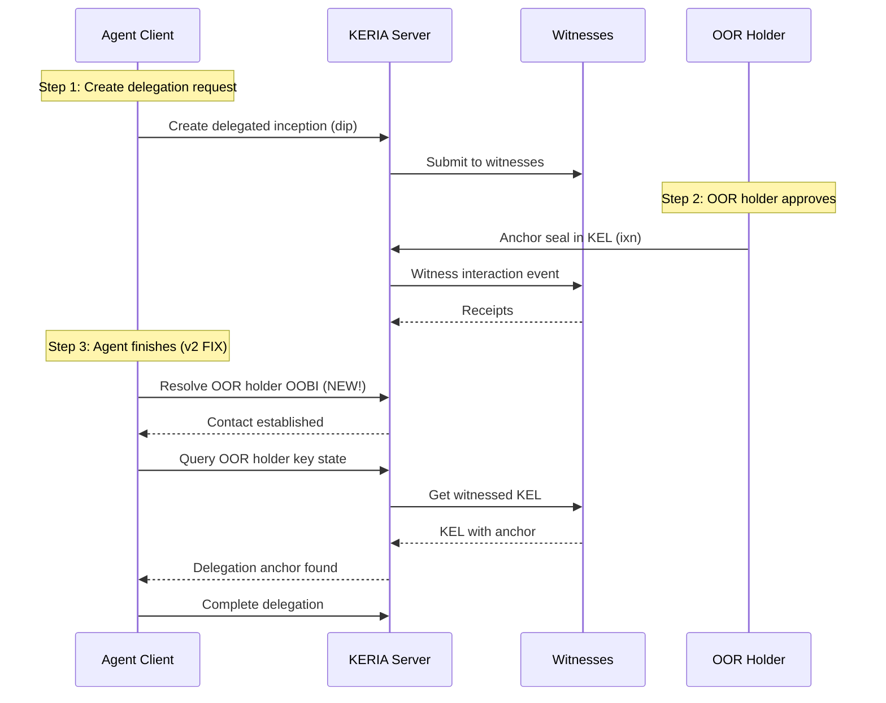

# Agent Delegation OOBI Resolution Fix - Complete Guide

## Problem Summary

The vLEI agent delegation process fails with the error:

```
✗ CRITICAL ERROR in Step 1: Failed to query key state after 5 attempts. 
This usually means witness receipts are not being received. 
Check: (1) Witnesses are running, (2) OOR holder has witnesses configured, 
(3) Network connectivity between services
```

## Root Cause Analysis

Based on the official vLEI training documentation:

### From `101_47_Delegated_AIDs.md` - Delegated AIDs

The delegation process is **cooperative** and requires:

1. **Delegate initiates** - Agent creates delegation request (dip event)
2. **Delegator approves** - OOR holder anchors approval seal in their KEL
3. **Delegate completes** - Agent queries delegator's KEL to find the anchor

The key insight:
> "The Delegate AID completes delegation by receiving from the Delegator AID 
> a current copy of the delegator's KEL which now includes the anchoring 
> delegation approval seal."

This means the agent MUST be able to reach the OOR holder's KEL to complete delegation.

### From `102_05_KERIA_Signify.md` - KERIA/Signify Architecture

Each Signify client session is independent:
> "Your sensitive private keys, used for signing key events and other data, 
> remain on the client-side (managed by a Signify client library)."

This means:
- Each client session has its own contact database
- **OOBIs must be resolved in each session** to establish contact
- A new client session doesn't inherit contacts from previous sessions

## The Missing Step

Looking at the agent delegation workflow:

```
person-delegate-agent-create.ts  →  Resolves OOR holder OOBI (client A)
person-approve-agent-delegation.ts  →  OOR holder approves
agent-aid-delegate-finish.ts  →  Agent finishes (client B) ← PROBLEM!
```

The issue: `agent-aid-delegate-finish.ts` creates a NEW client session (client B)
that doesn't have the OOR holder's OOBI resolved. When it tries to query the
OOR holder's key state, it times out because it doesn't know how to reach them.

## The Fix

The fix adds a **Step 0** to resolve the OOR holder's OOBI before querying
their key state:

```typescript
// Step 0: CRITICAL FIX - Resolve OOR Holder's OOBI
await resolveOobiWithRetries(
    agentClient,
    oorHolderInfo.oobi,
    oorHolderName,
    3,  // retries
    2000  // retry delay
);

// Step 1: Now we can query their key state
await queryKeyStateWithRetries(agentClient, oorHolderPre, '1', 5, 3000);
```

## How to Apply the Fix

### Option 1: Use the Fix Script (Recommended)

```bash
cd ~/projects/LegentvLEI
chmod +x apply-oobi-resolution-fix.sh
./apply-oobi-resolution-fix.sh
```

### Option 2: Manual Application

1. **Backup the original file:**
   ```bash
   cp sig-wallet/src/tasks/agent/agent-aid-delegate-finish.ts \
      sig-wallet/src/tasks/agent/agent-aid-delegate-finish.ts.backup
   ```

2. **Copy the fixed version:**
   ```bash
   cp sig-wallet/src/tasks/agent/agent-aid-delegate-finish-v2.ts \
      sig-wallet/src/tasks/agent/agent-aid-delegate-finish.ts
   ```

3. **Rebuild the container:**
   ```bash
   docker compose build --no-cache tsx-shell
   docker compose restart tsx-shell
   ```

## Verifying the Fix

After applying the fix, re-run your deployment:

```bash
./run-all-buyerseller-2C-with-agents.sh
```

You should see the new Step 0 output:

```
══════════════════════════════════════════════════════════════════════
FINISHING AGENT DELEGATION (v2 - WITH OOBI FIX)
══════════════════════════════════════════════════════════════════════

[0/5] RESOLVING OOR HOLDER'S OOBI (CRITICAL)
This step is REQUIRED before querying key state.
Without OOBI resolution, the agent doesn't know how to reach
the OOR holder to verify the delegation anchor.

Resolving OOBI for Jupiter_Chief_Sales_Officer...
  OOBI: http://keria:3902/oobi/ENs9aVxT.../agent/EMAjgjvf...
  Attempt 1/3...
  ✓ OOBI resolution (attempt 1) completed successfully
✓ OOBI resolved for Jupiter_Chief_Sales_Officer
✓ Step 0 complete: OOR Holder OOBI resolved

[1/5] Querying OOR Holder key state to find delegation anchor...
  ...
```

## Understanding the Delegation Flow



## Additional Troubleshooting

If you still have issues after applying the fix:

### Check Witnesses

```bash
# Verify witnesses are healthy
curl http://127.0.0.1:5642/oobi  # wan
curl http://127.0.0.1:5643/oobi  # wil
curl http://127.0.0.1:5644/oobi  # wes
curl http://127.0.0.1:5645/oobi  # wit
curl http://127.0.0.1:5646/oobi  # wub
curl http://127.0.0.1:5647/oobi  # wyz
```

### Check KERIA Logs

```bash
docker compose logs keria | tail -100
```

### Check Witness Receipts

The OOR holder's interaction event (delegation approval) needs to be witnessed.
If witnesses aren't responding, the key state query will timeout.

```bash
docker compose logs witness | grep -i "error\|fail\|receipt"
```

### Verify OOR Holder OOBI

Ensure the OOR holder's OOBI is accessible:

```bash
# From inside the tsx-shell container
docker compose exec tsx-shell curl -v http://keria:3902/oobi/<OOR_HOLDER_PREFIX>/agent/<AGENT_PREFIX>
```

## Technical Details

### Why OOBI Resolution is Required

From KERI specification and vLEI training:

1. **OOBIs (Out-of-Band Introductions)** are URLs that bootstrap discovery
2. When you resolve an OOBI, you establish a "contact" with that AID
3. Without establishing contact, you can't query their key state
4. Each Signify client session maintains its own contact database

### The Key State Query

When querying key state `await client.keyStates().query(prefix, '1')`:
- The '1' is the sequence number (first interaction event after inception)
- This event contains the delegation anchor seal
- The seal proves the OOR holder approved the delegation

### Witness Configuration

According to `101_40_Witnesses.md`:
- TOAD (Threshold of Accountable Duplicity) determines how many witness
  receipts are needed
- With 6 witnesses and toad=1, only 1 witness receipt is needed
- But that 1 receipt must still propagate through the network

## References

- vLEI Training: 101_47_Delegated_AIDs.md - Cooperative Delegation
- vLEI Training: 101_40_Witnesses.md - Witness Configuration
- vLEI Training: 102_05_KERIA_Signify.md - KERIA/Signify Architecture
- KERI Specification: https://trustoverip.github.io/tswg-keri-specification/
